# Architecture Documentation

## System Overview

Life Tracker is a server-first web application built with SvelteKit for managing tasks, chores, and habits. The MVP uses a traditional request/response architecture with plans to evolve into a local-first application with offline sync capabilities.

## Core Concepts

### Mental Model

**Categories** are named instances (e.g., "Household Chores", "Work Tasks", "Fitness Habits"). Each category:

- Is created from a template (Tasks, Chores, or Habits)
- Can be private or explicitly shared with others
- Contains items of that template type

### Three Core Trackers

1. **Tasks** - Action items with priorities

   - Priority: Urgent/High/Medium/Low
   - Optional: Assignee, Deadline, Time estimate
   - Can be one-off or recurring
   - Archived when completed

2. **Chores** - Recurring maintenance

   - Always recurring (weekly, monthly, etc.)
   - Assignable to household members
   - Archived when completed

3. **Habits** - Daily tracking
   - Log entries per day with optional notes
   - Track streaks (consecutive days)
   - Track frequency goals (e.g., 3x per week)
   - Mark as good or bad habit

## Use Case Diagrams

### Overall System Use Cases

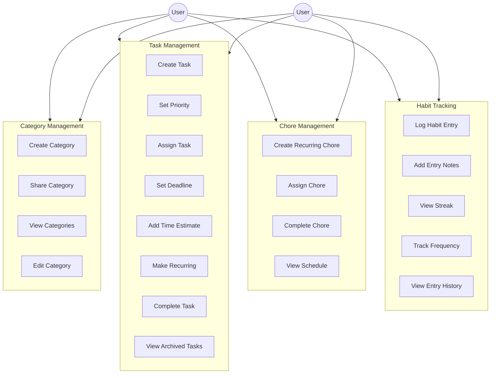

### Task Management Flow

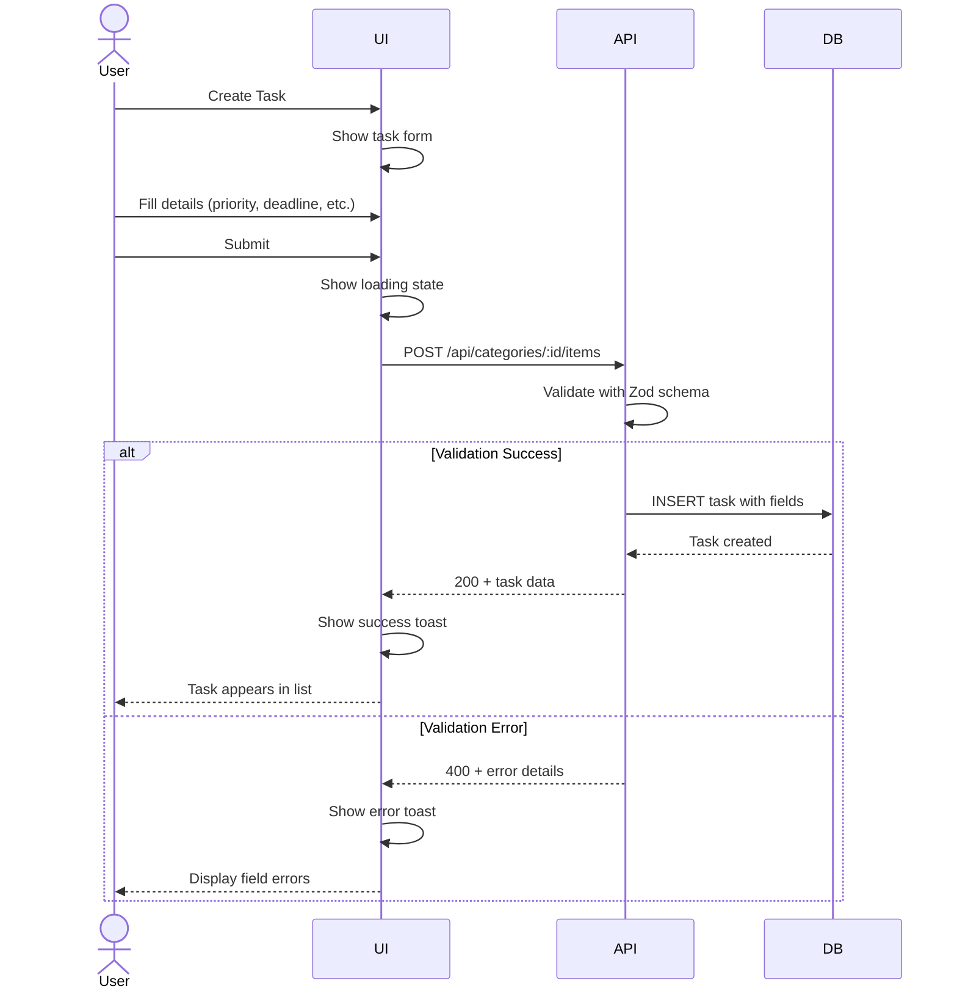

### Recurring Task Flow

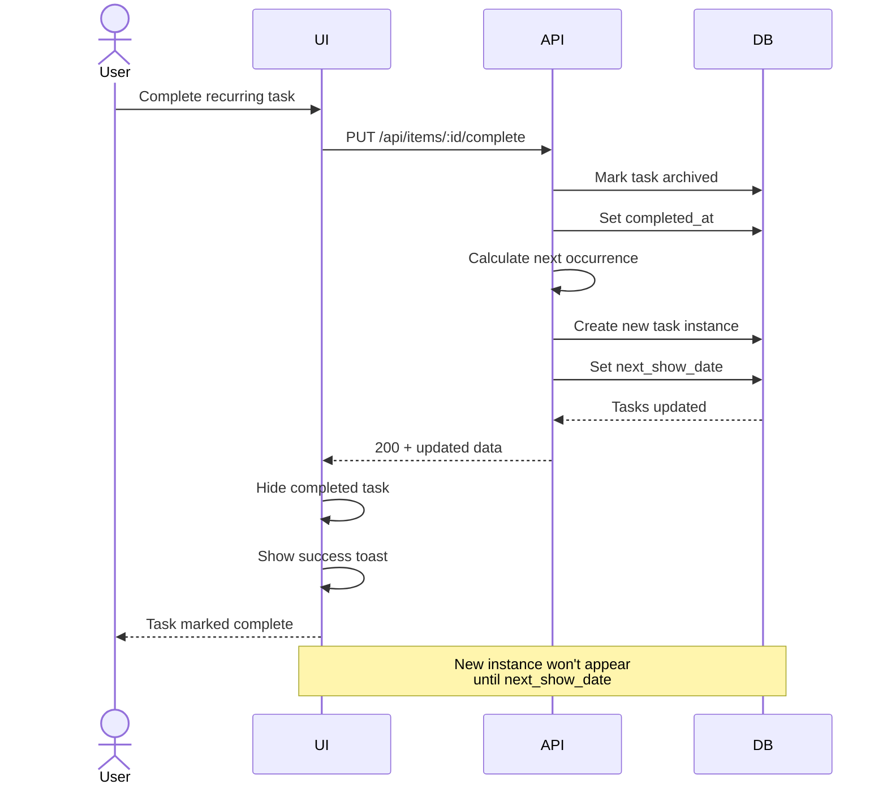

### Habit Tracking Flow

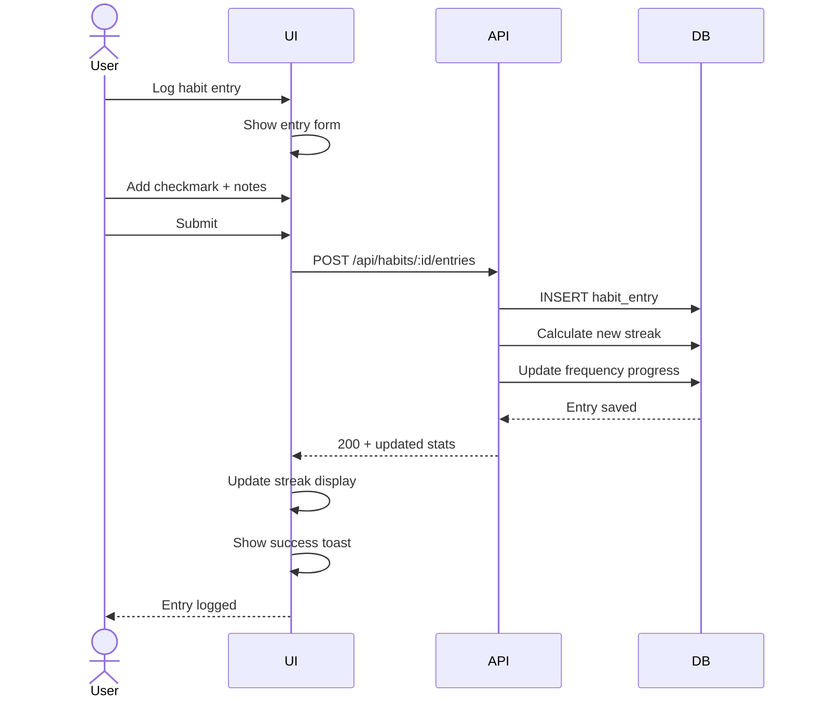

### Sharing Flow

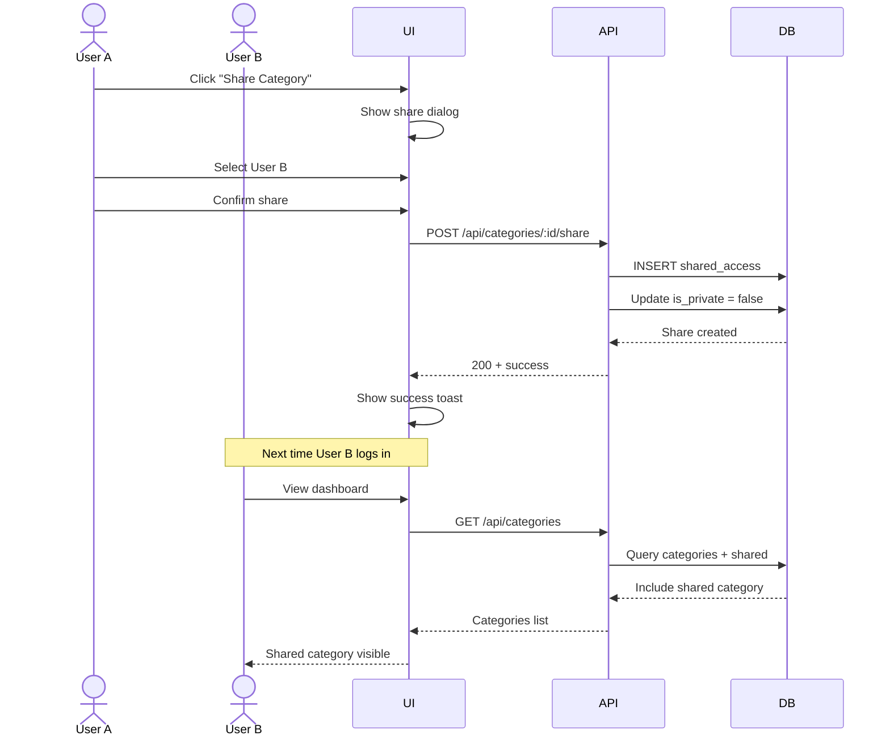

## Architecture Diagrams

### MVP Architecture (Phase 1)

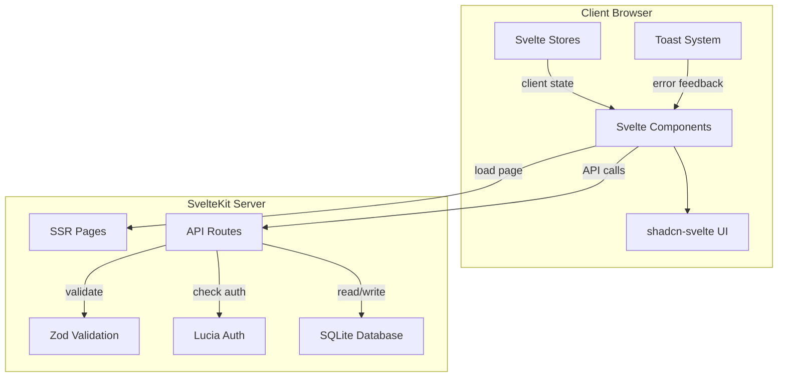

### Future Architecture (Post-MVP)

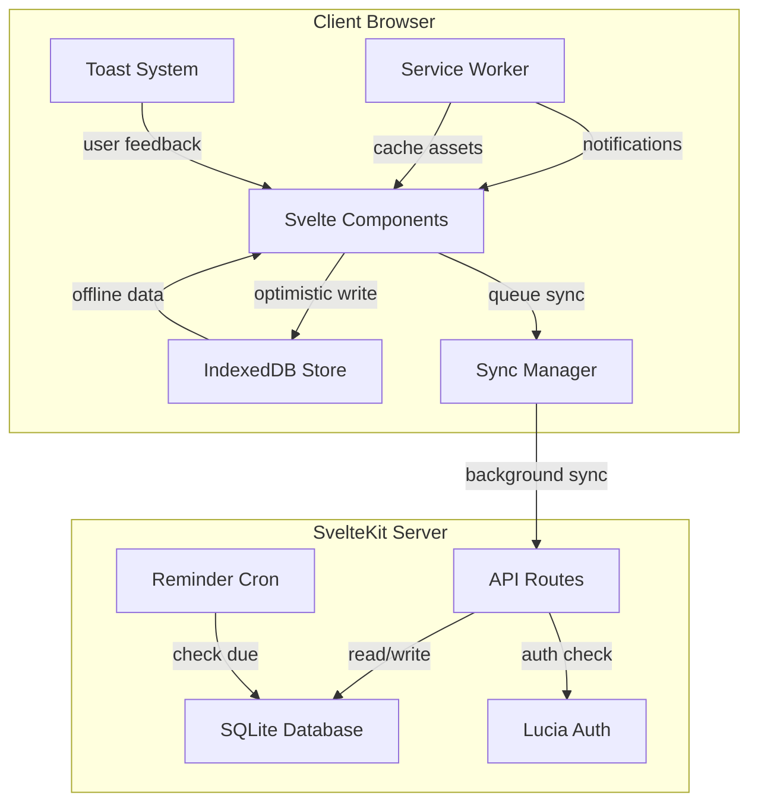

## Component Architecture

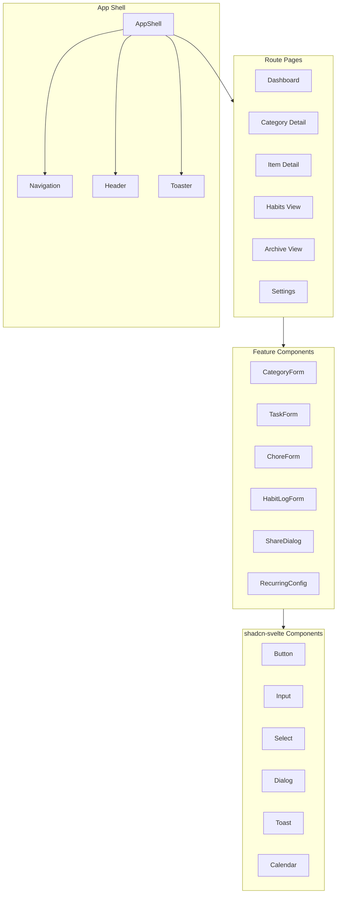

## Technology Stack

### Frontend

- **SvelteKit**: Meta-framework for SSR, routing, and API
- **TypeScript**: Type safety throughout
- **Tailwind CSS**: Utility-first styling
- **shadcn-svelte**: Pre-built accessible components
- **Svelte Stores**: Client-side state management
- **svelte-sonner**: Toast notifications
- **Zod**: Runtime validation and type inference

### Backend

- **SvelteKit API Routes**: RESTful API
- **better-sqlite3**: Synchronous SQLite driver
- **Lucia Auth v3**: Session-based authentication
- **Zod**: Request/response validation

### Testing

- **Vitest**: Unit and integration tests (co-located)
- **Histoire**: Component development and stories
- **Playwright**: End-to-end tests
- **vitest-axe**: Accessibility testing

### DevOps

- **Docker**: Containerization
- **GitHub Actions**: CI/CD
- **Caddy**: Reverse proxy with auto-HTTPS
- **Node 24**: LTS runtime

## Data Flow

### MVP: Traditional Request/Response

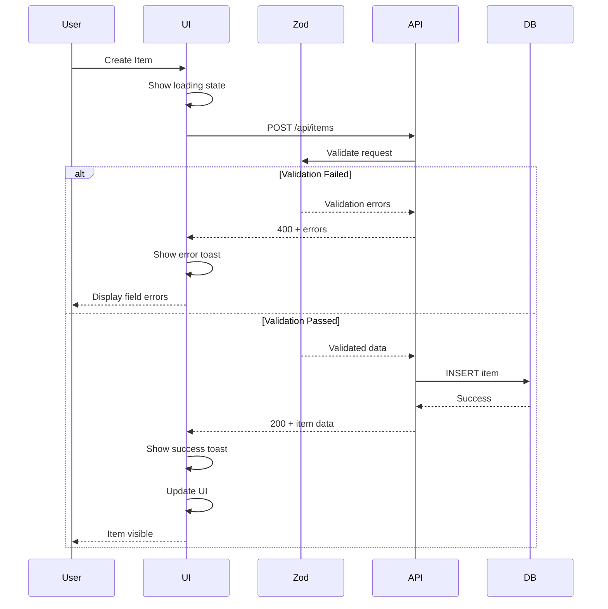

### Error Handling Flow

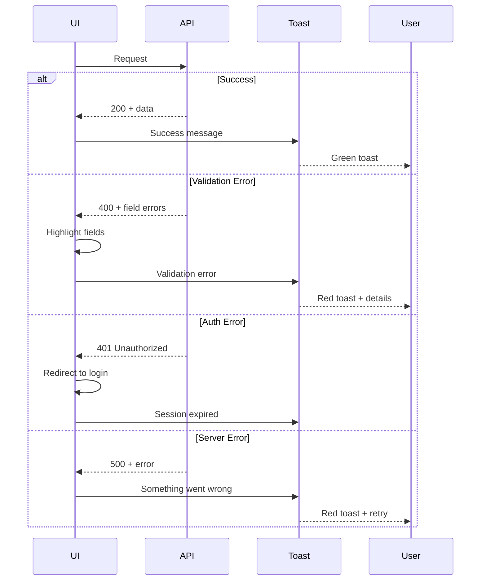

## Key Design Decisions

### Why Server-First for MVP?

- **Simpler**: Traditional patterns, less complexity
- **Faster to build**: Skip sync queue, conflict resolution
- **Proven**: Well-understood architecture
- **Progressive**: Can add optimistic UI later

### Why SQLite?

- **Simple deployment**: Single file database
- **Perfect for 2 users**: No need for client/server database
- **Local-first ready**: Can sync to IndexedDB later
- **Lightweight**: No database server needed

### Why Lucia Auth?

- **SvelteKit-first**: Built for SvelteKit patterns
- **Session-based**: Simple, secure, SSR-friendly
- **Type-safe**: Full TypeScript support
- **Flexible**: Easy to extend later

### Why Zod?

- **Type inference**: Types from schemas automatically
- **Runtime validation**: Catch errors at API boundary
- **Great DX**: Clear error messages
- **Composable**: Reuse schemas across client/server

### Why shadcn-svelte?

- **Accessible**: Built with a11y in mind
- **Customizable**: Tailwind-based, full control
- **Own the code**: Components in your repo
- **Modern**: Latest Svelte patterns

### Why Histoire?

- **Svelte-native**: Built for Svelte/SvelteKit
- **Fast**: Vite-powered
- **Simple**: Less config than Storybook
- **Integrated**: Works well with existing setup

### Why Co-located Tests?

- **Discoverability**: Tests next to implementation
- **Maintenance**: Easy to find and update
- **Context**: Tests close to code they test
- **Convention**: Common in modern codebases

## Deployment Architecture

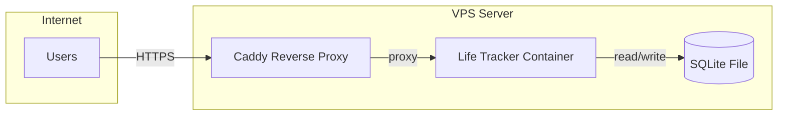

### Deployment Flow

1. Push to GitHub main branch
2. GitHub Actions builds Docker image
3. Security scan with Trivy
4. Push image to ghcr.io
5. SSH to VPS and pull new image
6. Restart container with new image
7. Caddy handles HTTPS and routing

## Security Considerations

### Authentication

- Passwords hashed with bcrypt (via Lucia)
- HTTP-only session cookies
- CSRF protection via SvelteKit
- Session expiration (7 days)

### Data Privacy

- Each user sees only their data
- Shared categories require explicit permission
- No cross-user data leakage
- SQL injection prevented (prepared statements)

### Network Security

- All traffic over HTTPS (Caddy)
- Rate limiting on API endpoints
- Security headers (CSP, HSTS, etc.)
- Input validation with Zod

### Error Handling

- Never expose stack traces to client
- Log errors server-side
- User-friendly error messages
- Toast notifications for all errors

## Performance Considerations

### MVP

- Server-side rendering for fast initial load
- Static asset caching
- Database indices on foreign keys
- Pagination for large lists
- Optimistic UI feedback (loading states)

### Testing Strategy

- Unit tests for all logic (co-located)
- Histoire stories for all components
- E2E tests for critical user flows
- Accessibility tests with vitest-axe
- Performance budgets in CI

### Accessibility

- Semantic HTML throughout
- ARIA labels where needed
- Keyboard navigation
- Focus management
- Screen reader tested
- Color contrast compliance

### Future Optimizations

- IndexedDB caching
- Optimistic UI updates
- Service Worker asset caching
- Background sync
- Virtual scrolling for large lists

## Scalability Notes

### Current (2 users)

- Single SQLite file sufficient
- No replication needed
- Simple backup strategy
- Single VPS container

### Future (if expanding)

- Consider PostgreSQL for > 10 users
- Add Redis for sessions
- Implement proper caching layer
- Database connection pooling
- Multiple app instances behind load balancer
