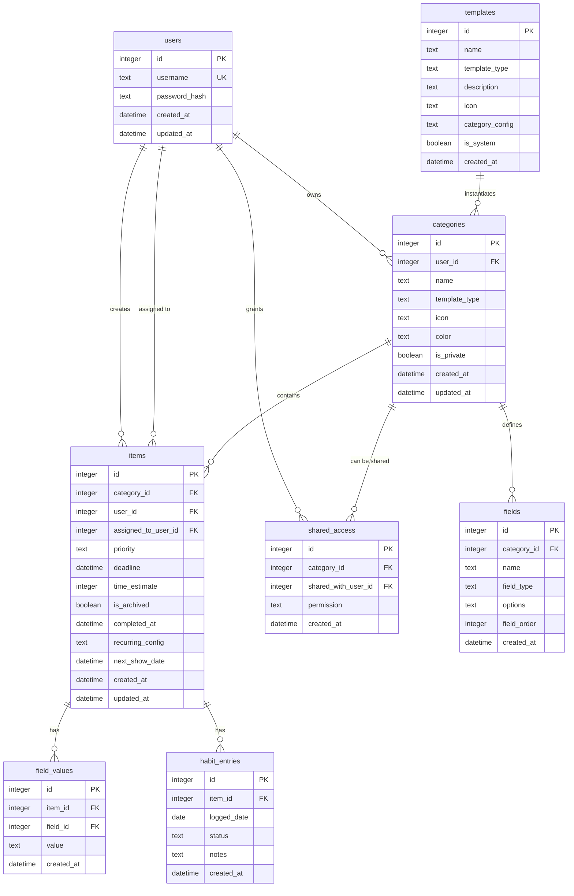

# Database Schema

## Overview

The database supports three core tracker types (Tasks, Chores, Habits) through a flexible category/item/field system. All tables are created upfront to support future features.

## Entity Relationship Diagram



## Table Details

### users

User accounts for authentication.

```sql
CREATE TABLE users (
    id INTEGER PRIMARY KEY AUTOINCREMENT,
    username TEXT NOT NULL UNIQUE,
    password_hash TEXT NOT NULL,
    created_at DATETIME NOT NULL DEFAULT CURRENT_TIMESTAMP,
    updated_at DATETIME NOT NULL DEFAULT CURRENT_TIMESTAMP
);

CREATE INDEX idx_users_username ON users(username);
```

**MVP Usage:** Active (2 users)

---

### categories

Named instances of tracker types (e.g., "Household Chores", "Work Tasks").

```sql
CREATE TABLE categories (
    id INTEGER PRIMARY KEY AUTOINCREMENT,
    user_id INTEGER NOT NULL,
    name TEXT NOT NULL,
    template_type TEXT NOT NULL CHECK(template_type IN ('task', 'chore', 'habit')),
    icon TEXT,
    color TEXT,
    is_private BOOLEAN NOT NULL DEFAULT 1,
    created_at DATETIME NOT NULL DEFAULT CURRENT_TIMESTAMP,
    updated_at DATETIME NOT NULL DEFAULT CURRENT_TIMESTAMP,
    FOREIGN KEY (user_id) REFERENCES users(id) ON DELETE CASCADE
);

CREATE INDEX idx_categories_user_id ON categories(user_id);
CREATE INDEX idx_categories_template_type ON categories(template_type);
CREATE INDEX idx_categories_is_private ON categories(is_private);
```

**MVP Usage:** Active

**Fields:**

- `template_type`: `task`, `chore`, or `habit`
- `is_private`: `true` until shared
- `icon`: Emoji or icon identifier
- `color`: Hex color code

---

### fields

Dynamic field definitions for categories. Defines structure for items.

```sql
CREATE TABLE fields (
    id INTEGER PRIMARY KEY AUTOINCREMENT,
    category_id INTEGER NOT NULL,
    name TEXT NOT NULL,
    field_type TEXT NOT NULL CHECK(field_type IN ('text', 'number', 'date', 'boolean', 'select')),
    options TEXT,
    field_order INTEGER NOT NULL DEFAULT 0,
    created_at DATETIME NOT NULL DEFAULT CURRENT_TIMESTAMP,
    FOREIGN KEY (category_id) REFERENCES categories(id) ON DELETE CASCADE
);

CREATE INDEX idx_fields_category_id ON fields(category_id);
CREATE INDEX idx_fields_order ON fields(category_id, field_order);
```

**MVP Usage:** Active

**Field Types:**

- `text`: Free text (title, description, notes)
- `number`: Numeric values
- `date`: Date picker
- `boolean`: Checkbox (e.g., completed)
- `select`: Dropdown with options (JSON array in `options`)

---

### items

Tasks, chores, or habit trackers within categories.

```sql
CREATE TABLE items (
    id INTEGER PRIMARY KEY AUTOINCREMENT,
    category_id INTEGER NOT NULL,
    user_id INTEGER NOT NULL,
    assigned_to_user_id INTEGER,
    priority TEXT CHECK(priority IN ('urgent', 'high', 'medium', 'low')),
    deadline DATETIME,
    time_estimate INTEGER,
    is_archived BOOLEAN NOT NULL DEFAULT 0,
    completed_at DATETIME,
    recurring_config TEXT,
    next_show_date DATETIME,
    created_at DATETIME NOT NULL DEFAULT CURRENT_TIMESTAMP,
    updated_at DATETIME NOT NULL DEFAULT CURRENT_TIMESTAMP,
    FOREIGN KEY (category_id) REFERENCES categories(id) ON DELETE CASCADE,
    FOREIGN KEY (user_id) REFERENCES users(id) ON DELETE CASCADE,
    FOREIGN KEY (assigned_to_user_id) REFERENCES users(id) ON DELETE SET NULL
);

CREATE INDEX idx_items_category_id ON items(category_id);
CREATE INDEX idx_items_user_id ON items(user_id);
CREATE INDEX idx_items_assigned_to ON items(assigned_to_user_id);
CREATE INDEX idx_items_priority ON items(priority);
CREATE INDEX idx_items_deadline ON items(deadline);
CREATE INDEX idx_items_is_archived ON items(is_archived);
CREATE INDEX idx_items_next_show_date ON items(next_show_date);
CREATE INDEX idx_items_created_at ON items(created_at DESC);
```

**MVP Usage:** Active

**Core Fields:**

- `user_id`: Creator of the item
- `assigned_to_user_id`: Who is responsible (nullable)

**Task-Specific:**

- `priority`: `urgent`, `high`, `medium`, `low` (only for tasks)
- `deadline`: Due date (optional)
- `time_estimate`: Estimated minutes to complete (optional)

**Archiving:**

- `is_archived`: `true` when completed
- `completed_at`: Timestamp of completion

**Recurring:**

- `recurring_config`: JSON with frequency and interval
- `next_show_date`: When to show next occurrence

**recurring_config format:**

```json
{
	"frequency": "weekly",
	"interval": 1,
	"unit": "weeks"
}
```

---

### field_values

Actual data for each item. Uses EAV pattern for flexibility.

```sql
CREATE TABLE field_values (
    id INTEGER PRIMARY KEY AUTOINCREMENT,
    item_id INTEGER NOT NULL,
    field_id INTEGER NOT NULL,
    value TEXT,
    created_at DATETIME NOT NULL DEFAULT CURRENT_TIMESTAMP,
    FOREIGN KEY (item_id) REFERENCES items(id) ON DELETE CASCADE,
    FOREIGN KEY (field_id) REFERENCES fields(id) ON DELETE CASCADE,
    UNIQUE(item_id, field_id)
);

CREATE INDEX idx_field_values_item_id ON field_values(item_id);
CREATE INDEX idx_field_values_field_id ON field_values(field_id);
```

**MVP Usage:** Active

**Note:** All values stored as TEXT, parsed by field_type.

---

### habit_entries

Daily entries for habit tracking.

```sql
CREATE TABLE habit_entries (
    id INTEGER PRIMARY KEY AUTOINCREMENT,
    item_id INTEGER NOT NULL,
    logged_date DATE NOT NULL,
    status TEXT NOT NULL CHECK(status IN ('done', 'skipped', 'failed')),
    notes TEXT,
    created_at DATETIME NOT NULL DEFAULT CURRENT_TIMESTAMP,
    FOREIGN KEY (item_id) REFERENCES items(id) ON DELETE CASCADE,
    UNIQUE(item_id, logged_date)
);

CREATE INDEX idx_habit_entries_item_id ON habit_entries(item_id);
CREATE INDEX idx_habit_entries_date ON habit_entries(logged_date DESC);
CREATE INDEX idx_habit_entries_item_date ON habit_entries(item_id, logged_date);
```

**MVP Usage:** Active (for habit categories)

**Fields:**

- `logged_date`: The day this entry is for (YYYY-MM-DD)
- `status`: `done`, `skipped`, or `failed`
- `notes`: Optional user notes about the entry

**Unique constraint:** One entry per habit per day

---

### shared_access

Category sharing between users.

```sql
CREATE TABLE shared_access (
    id INTEGER PRIMARY KEY AUTOINCREMENT,
    category_id INTEGER NOT NULL,
    shared_with_user_id INTEGER NOT NULL,
    permission TEXT NOT NULL CHECK(permission IN ('view', 'edit')),
    created_at DATETIME NOT NULL DEFAULT CURRENT_TIMESTAMP,
    FOREIGN KEY (category_id) REFERENCES categories(id) ON DELETE CASCADE,
    FOREIGN KEY (shared_with_user_id) REFERENCES users(id) ON DELETE CASCADE,
    UNIQUE(category_id, shared_with_user_id)
);

CREATE INDEX idx_shared_access_category_id ON shared_access(category_id);
CREATE INDEX idx_shared_access_user_id ON shared_access(shared_with_user_id);
```

**MVP Usage:** Active

**Permissions:**

- `view`: Read-only access
- `edit`: Full CRUD access

---

### templates

Pre-defined category templates.

```sql
CREATE TABLE templates (
    id INTEGER PRIMARY KEY AUTOINCREMENT,
    name TEXT NOT NULL,
    template_type TEXT NOT NULL CHECK(template_type IN ('task', 'chore', 'habit')),
    description TEXT,
    icon TEXT,
    category_config TEXT NOT NULL,
    is_system BOOLEAN NOT NULL DEFAULT 0,
    created_at DATETIME NOT NULL DEFAULT CURRENT_TIMESTAMP
);

CREATE INDEX idx_templates_type ON templates(template_type);
CREATE INDEX idx_templates_is_system ON templates(is_system);
```

**MVP Usage:** Active

**category_config format:**

```json
{
	"name": "Tasks",
	"icon": "✓",
	"color": "#3b82f6",
	"fields": [
		{ "name": "Title", "field_type": "text", "field_order": 1 },
		{ "name": "Description", "field_type": "text", "field_order": 2 }
	]
}
```

---

## Built-in Templates (MVP)

### 1. Tasks Template

```json
{
	"name": "Tasks",
	"template_type": "task",
	"icon": "✓",
	"color": "#3b82f6",
	"fields": [
		{ "name": "Title", "field_type": "text", "field_order": 1 },
		{ "name": "Description", "field_type": "text", "field_order": 2 }
	]
}
```

**Additional metadata in `items` table:**

- `priority`: urgent/high/medium/low
- `deadline`: Optional datetime
- `time_estimate`: Optional minutes
- `recurring_config`: Optional
- `assigned_to_user_id`: Optional

### 2. Chores Template

```json
{
	"name": "Chores",
	"template_type": "chore",
	"icon": "🧹",
	"color": "#10b981",
	"fields": [
		{ "name": "Chore Name", "field_type": "text", "field_order": 1 },
		{ "name": "Notes", "field_type": "text", "field_order": 2 }
	]
}
```

**Additional metadata:**

- `recurring_config`: Required (chores are always recurring)
- `assigned_to_user_id`: Optional

### 3. Habits Template

```json
{
	"name": "Habits",
	"template_type": "habit",
	"icon": "📈",
	"color": "#8b5cf6",
	"fields": [
		{ "name": "Habit Name", "field_type": "text", "field_order": 1 },
		{ "name": "Goal", "field_type": "text", "field_order": 2 },
		{ "name": "Is Good Habit", "field_type": "boolean", "field_order": 3 }
	]
}
```

**Uses `habit_entries` table** for daily logging.

---

## Common Queries

### Get all non-archived items for category

```sql
SELECT
    i.*,
    f.name as field_name,
    f.field_type,
    fv.value,
    u.username as assigned_to
FROM items i
LEFT JOIN field_values fv ON fv.item_id = i.id
LEFT JOIN fields f ON f.id = fv.field_id
LEFT JOIN users u ON u.id = i.assigned_to_user_id
WHERE i.category_id = ?
  AND i.is_archived = 0
  AND (i.next_show_date IS NULL OR i.next_show_date <= CURRENT_TIMESTAMP)
ORDER BY
    CASE i.priority
        WHEN 'urgent' THEN 1
        WHEN 'high' THEN 2
        WHEN 'medium' THEN 3
        WHEN 'low' THEN 4
    END,
    i.deadline ASC,
    i.created_at DESC;
```

### Get items assigned to user

```sql
SELECT
    i.*,
    c.name as category_name,
    c.icon as category_icon
FROM items i
JOIN categories c ON c.id = i.category_id
WHERE i.assigned_to_user_id = ?
  AND i.is_archived = 0
  AND (i.next_show_date IS NULL OR i.next_show_date <= CURRENT_TIMESTAMP)
ORDER BY i.deadline ASC NULLS LAST;
```

### Get habit streak

```sql
WITH RECURSIVE dates AS (
    SELECT DATE('now') as date
    UNION ALL
    SELECT DATE(date, '-1 day')
    FROM dates
    LIMIT 365
)
SELECT
    d.date,
    he.status
FROM dates d
LEFT JOIN habit_entries he ON he.item_id = ? AND he.logged_date = d.date
ORDER BY d.date DESC;
```

Then calculate streak in application code.

### Get shared categories for user

```sql
SELECT
    c.*,
    u.username as owner_username,
    sa.permission
FROM categories c
JOIN shared_access sa ON sa.category_id = c.id
JOIN users u ON u.id = c.user_id
WHERE sa.shared_with_user_id = ?;
```

### Complete recurring item

```sql
-- Mark current item archived
UPDATE items
SET is_archived = 1,
    completed_at = CURRENT_TIMESTAMP
WHERE id = ?;

-- Create next occurrence
INSERT INTO items (
    category_id,
    user_id,
    assigned_to_user_id,
    recurring_config,
    next_show_date,
    created_at
) VALUES (
    ?, ?, ?, ?,
    datetime('now', '+7 days'), -- calculated from recurring_config
    CURRENT_TIMESTAMP
);

-- Copy field_values to new item
INSERT INTO field_values (item_id, field_id, value)
SELECT ?, field_id, value
FROM field_values
WHERE item_id = ?;
```

---

## Migration Strategy

Migrations are SQL files in `src/lib/server/db/migrations/`:

- `001_initial_schema.sql`: All tables
- `002_seed_templates.sql`: System templates
- Future migrations numbered sequentially

Track with `schema_version` table:

```sql
CREATE TABLE schema_version (
    version INTEGER PRIMARY KEY,
    applied_at DATETIME NOT NULL DEFAULT CURRENT_TIMESTAMP
);
```

---

## Validation with Zod

Example schemas:

```typescript
// Task creation
export const createTaskSchema = z.object({
	category_id: z.number().int().positive(),
	priority: z.enum(['urgent', 'high', 'medium', 'low']),
	deadline: z.string().datetime().optional(),
	time_estimate: z.number().int().positive().optional(),
	assigned_to_user_id: z.number().int().positive().optional(),
	recurring_config: z
		.object({
			frequency: z.enum(['daily', 'weekly', 'monthly']),
			interval: z.number().int().positive()
		})
		.optional(),
	values: z.record(z.string(), z.string())
});

// Habit entry
export const habitEntrySchema = z.object({
	logged_date: z.string().regex(/^\d{4}-\d{2}-\d{2}$/),
	status: z.enum(['done', 'skipped', 'failed']),
	notes: z.string().max(500).optional()
});
```

---

## Backup Strategy

Database file location: `/mnt/app-data/life-tracker/db.sqlite`

Backed up daily at 2 AM via existing VPS backup script.

---

## Performance Considerations

### Indices

All foreign keys indexed for JOIN performance.
Additional indices on common query fields (priority, deadline, archived, etc.).

### Pagination

Use `LIMIT/OFFSET` for large lists.

### Future Optimization

- Add compound indices for common queries
- Consider materialized views for statistics
- SQLite WAL mode for better concurrency
