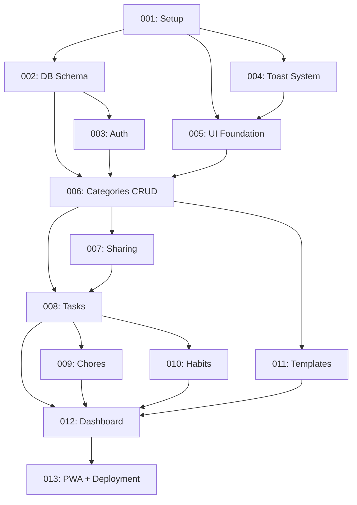

# Development Tickets Index

All tickets for Life Tracker MVP development.

## 🎯 MVP Tickets (13 total)

Core functionality to get a working app deployed.

| ID  | Ticket                                                       | Scope                        | Description                                                  |
| --- | ------------------------------------------------------------ | ---------------------------- | ------------------------------------------------------------ |
| 001 | [Setup](./ticket-001-setup.md)                               | `setup`, `ticket-001`        | SvelteKit + TypeScript + Tailwind + shadcn + Zod + Histoire  |
| 002 | [DB Schema](./ticket-002-db-schema.md)                       | `db`, `ticket-002`           | SQLite schema for tasks/chores/habits + migrations           |
| 003 | [Auth](./ticket-003-auth.md)                                 | `auth`, `ticket-003`         | Lucia Auth v3 session-based authentication                   |
| 004 | [Toast System](./ticket-004-toast-system.md)                 | `ui`, `ticket-004`           | svelte-sonner global toast notifications                     |
| 005 | [UI Foundation](./ticket-005-ui-foundation.md)               | `ui`, `ticket-005`           | shadcn-svelte components + comprehensive unit tests          |
| 006 | [Categories CRUD](./ticket-006-categories-crud.md)           | `categories`, `ticket-006`   | Create, read, update, delete categories with template_type   |
| 007 | [Sharing](./ticket-007-sharing.md)                           | `categories`, `ticket-007`   | Explicit category sharing with view/edit permissions         |
| 008 | [Tasks](./ticket-008-tasks.md)                               | `items`, `ticket-008`        | Priority, assignment, deadline, estimate, recurring, archive |
| 009 | [Chores](./ticket-009-chores.md)                             | `items`, `ticket-009`        | Recurring chores with assignment and archiving               |
| 010 | [Habits](./ticket-010-habits.md)                             | `habits`, `ticket-010`       | Daily entries, streaks, frequency tracking                   |
| 011 | [Templates](./ticket-011-templates.md)                       | `categories`, `ticket-011`   | Pre-built templates (Tasks, Chores, Habits)                  |
| 012 | [Dashboard](./ticket-012-dashboard.md)                       | `ui`, `ticket-012`           | Home page with overview, assigned, due soon, habits          |
| 013 | [PWA + Deployment + E2E](./ticket-013-pwa-deployment-e2e.md) | `setup`, `pwa`, `ticket-013` | PWA manifest, Docker, CI/CD, comprehensive E2E tests         |

**MVP Deliverable:** Working life tracker deployed at `tracker.timostermann.io`

---

## 🚀 Post-MVP Enhancement Tickets

Improvements to add after MVP is complete and deployed.

| ID  | Ticket                                                             | Scope                     | Description                                                  |
| --- | ------------------------------------------------------------------ | ------------------------- | ------------------------------------------------------------ |
| 014 | [Storybook Setup](./ticket-014-storybook-setup.md)                 | `storybook`, `ticket-014` | Add Storybook 8.4+ with Svelte 5 support for component docs  |
| 015 | [Emoji Picker Component](./ticket-015-emoji-picker.md)             | `ui`, `ticket-015`        | Replace text input with interactive emoji picker like Slack  |
| 016 | [Internationalization (i18n)](./ticket-016-i18n-implementation.md) | `i18n`, `ticket-016`      | Extract all texts to JSON and implement svelte-i18n solution |

---

## Ticket Dependencies



## Commit Scopes

Use these scopes in conventional commits:

**Functional scopes:**

- `setup`: Project configuration, tooling, build
- `db`: Database schema, migrations, queries
- `auth`: Authentication, sessions
- `categories`: Category management
- `items`: Items (tasks/chores/habit trackers)
- `habits`: Habit-specific features (entries, streaks)
- `ui`: UI components and pages
- `docs`: Documentation
- `api`: API endpoints
- `pwa`: PWA functionality
- `i18n`: Internationalization, translations
- `storybook`: Component documentation

**Ticket scopes:**

- `ticket-001` through `ticket-013`

**Example commits:**

```
feat(ticket-008): add task priority selection UI
fix(api): handle null assigned_to_user_id in queries
test(habits): add streak calculation unit tests
docs(ticket-012): update dashboard acceptance criteria
chore(setup): update shadcn-svelte components
```

## Implementation Notes

### Quality Embedded in All Tickets

Every ticket includes:

- **Testing**: Unit tests (co-located), E2E tests where applicable
- **Accessibility**: ARIA labels, keyboard navigation, screen reader support
- **Performance**: Query optimization, loading states, caching
- **Error Handling**: Toast notifications, validation, user-friendly messages

### Tech Stack

- **Framework**: SvelteKit (Node 24) + Svelte 5
- **UI**: shadcn-svelte + Tailwind CSS v4
- **Validation**: Zod schemas throughout
- **Auth**: Lucia Auth v3
- **Database**: SQLite (better-sqlite3)
- **Component Docs**: Storybook 8.4+ (coming in ticket-014)
- **Tests**: Vitest (co-located unit + browser) + Playwright (E2E)
- **Notifications**: svelte-sonner

### Test Strategy

**Unit Tests:**

- Co-located with source files
- Run in pre-commit hook
- Cover all logic, utils, API handlers

**Component Tests:**

- Vitest browser mode with Playwright
- All custom components tested
- Accessibility and interaction testing

**E2E Tests:**

- All critical user flows
- Comprehensive test in ticket-013
- Run in CI on all PRs

## Workflow

1. **Pick a ticket** (follow dependency order)
2. **Create branch**: `git checkout -b ticket-XXX-short-name`
3. **Implement** following ticket tasks
4. **Test** (unit + component + E2E)
5. **Commit** using conventional commits with scopes
6. **Push** and create PR
7. **Merge** when tests pass

## Progress Tracking

- ⏳ **In Progress**: Currently working on
- ✅ **Done**: Completed and merged
- 🔜 **Blocked**: Waiting on dependencies

## Future Improvements

See [../FUTURE_IMPROVEMENTS.md](../FUTURE_IMPROVEMENTS.md) for deferred features:

- Search and filtering
- Statistics and analytics
- Data export
- Reminders/notifications
- Offline sync
- And more...
